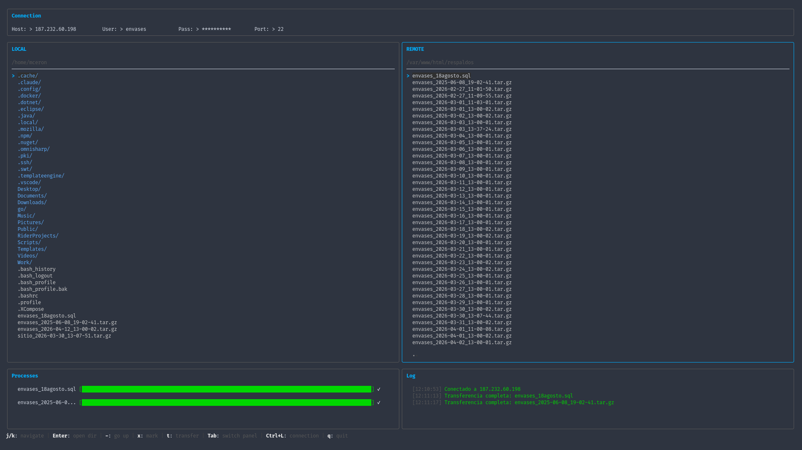

<div align="center">

# lazyftp

A simple, keyboard-driven TUI FTP/SFTP client inspired by [lazygit](https://github.com/jesseduffield/lazygit).

[](https://go.dev)
[](LICENSE)
[](https://github.com/MawCeron/lazyftp/stargazers)



</div>

---

## About

lazyftp brings a familiar TUI experience to file transfers. If you live in the terminal and find yourself constantly switching to a GUI client just to move files around — this is for you.

Dual-pane local/remote navigation, real-time transfer progress, FTP and SFTP support, all from the keyboard.

### Built with

[](https://github.com/charmbracelet/bubbletea)
[](https://github.com/charmbracelet/lipgloss)

---

## Features

- FTP and SFTP support
- Dual-pane layout — local and remote side by side
- Real-time transfer progress with direction indicators
- Multiple file selection and batch transfers
- Keyboard-driven navigation (vim-style + arrow keys)
- Context-aware hints bar
- Transfer and connection log

---

## Installation

### From source

```bash
git clone https://github.com/MawCeron/lazyftp.git
cd lazyftp
go build -o lazyftp .
```

### With go install

```bash
go install github.com/MawCeron/lazyftp@latest
```

---

## Usage

```bash
lazyftp
```

### Connecting

Fill in the connection bar at the top:

| Field | Description |
|-------|-------------|
| Host | Server hostname or IP |
| User | Username |
| Pass | Password |
| Port | `22` for SFTP, any other port for FTP |

Press `Enter` to connect. The protocol is automatically selected based on the port.

### Transferring files

1. Navigate to the file or directory you want to transfer
2. Optionally mark multiple files with `x`
3. Press `t` to transfer

If you are in the **local panel**, the file will be uploaded to the current remote path. If you are in the **remote panel**, it will be downloaded to the current local path.

---

## Keybindings

### Global

| Key | Action |
|-----|--------|
| `Ctrl+L` | Focus connection bar |
| `Tab` | Switch between local and remote panels |
| `Esc` | Exit connection bar |
| `q` / `Q` | Quit |

### Connection bar

| Key | Action |
|-----|--------|
| `Tab` | Next field |
| `Shift+Tab` | Previous field |
| `Enter` | Connect |
| `Esc` | Close |

### Panels

| Key | Action |
|-----|--------|
| `j` / `↓` | Move down |
| `k` / `↑` | Move up |
| `Enter` / `Space` | Enter directory |
| `-` / `Backspace` | Go up one level |
| `x` | Mark / unmark file or directory |
| `t` | Transfer (upload or download depending on active panel) |

---

## Roadmap

- [ ] SSH key authentication for SFTP
- [ ] Rename files
- [ ] Delete files
- [ ] Create directories
- [ ] Toggle hidden files
- [ ] File permissions management
- [ ] Saved connections
- [ ] Multiple simultaneous connections

---

## Contributing

Pull requests are welcome. For major changes, please open an issue first.

---

## License

Distributed under the MIT License. See [LICENSE](LICENSE) for more information.