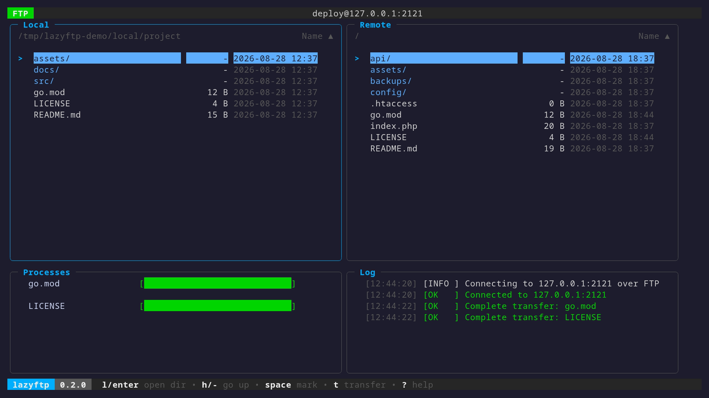

<div align="center">

# lazyftp

A simple, keyboard-driven TUI FTP, FTPS and SFTP client inspired by [lazygit](https://github.com/jesseduffield/lazygit).

[](https://go.dev)
[](LICENSE)
[](https://github.com/MawCeron/lazyftp/stargazers)



</div>

---

## About

lazyftp brings a familiar TUI experience to file transfers. If you live in the terminal and find yourself constantly switching to a GUI client just to move files around — this is for you.

Dual-pane local/remote navigation, real-time transfer progress, FTP, FTPS and SFTP support, all from the keyboard.

### Built with

[](https://github.com/charmbracelet/bubbletea)
[](https://github.com/charmbracelet/lipgloss)

---

## Features

- FTP, FTPS and SFTP support, chosen explicitly rather than guessed from the port
- Dual-pane layout — local and remote side by side
- Real-time transfer progress with direction indicators
- Multiple file selection and batch transfers
- Keyboard-driven navigation (vim-style + arrow keys)
- Context-aware hints bar
- Transfer and connection log

---

## Installation

### From source

```bash
git clone https://github.com/MawCeron/lazyftp.git
cd lazyftp
go build -o lazyftp .
```

### With go install

```bash
go install github.com/MawCeron/lazyftp@latest
```

---

## Usage

```bash
lazyftp
```

The local panel opens in the directory you ran it from, so `cd` to the project first and there is
nothing to navigate.

| Flag | What it does |
|------|--------------|
| `--verbose` | Show the FTP control dialogue in the Log panel |
| `--log-file <path>` | Write the log to a file as well, appending to it |

### Connecting

Fill in the connection bar at the top:

| Field | Description |
|-------|-------------|
| Proto | `FTP`, `FTPS` or `SFTP` — cycle with `←` / `→` |
| Host | Server hostname or IP |
| User | Username |
| Pass | Password |
| Port | Leave empty for the protocol's default: `21` for FTP and FTPS, `22` for SFTP |

Press `Enter` to connect, `Esc` to give up on an attempt that is taking too long.

FTPS is explicit — TLS is negotiated with `AUTH TLS` once the control connection is open — and the
server's certificate is verified. A server with a self-signed certificate is refused rather than
silently accepted.

### Transferring files

1. Navigate to the file or directory you want to transfer
2. Optionally mark multiple files with `x`
3. Press `t` to transfer

If you are in the **local panel**, the file will be uploaded to the current remote path. If you are in the **remote panel**, it will be downloaded to the current local path.

---

## Keybindings

### Global

| Key | Action |
|-----|--------|
| `Ctrl+L` | Focus connection bar |
| `Tab` | Switch between local and remote panels |
| `Esc` | Exit connection bar, or abandon a connection attempt |
| `q` / `Q` | Quit |

### Connection bar

| Key | Action |
|-----|--------|
| `Tab` | Next field |
| `Shift+Tab` | Previous field |
| `←` / `→` | Change protocol (on the Proto field) |
| `Enter` | Connect |
| `Esc` | Close, or abandon an attempt in progress |

### Panels

| Key | Action |
|-----|--------|
| `j` / `↓` | Move down |
| `k` / `↑` | Move up |
| `Enter` / `Space` | Enter directory |
| `-` / `Backspace` | Go up one level |
| `x` | Mark / unmark file or directory |
| `t` | Transfer (upload or download depending on active panel) |

---

## Roadmap

| Release | Focus |
|---------|-------|
| v0.1.2 | FTP connectivity and stability |
| v0.2.0 | TUI overhaul — responsive layout, theming, help screen |
| v0.3.0 | File operations — rename, delete, create directories |
| v0.4.0 | Connections and authentication — favorites, history, SSH keys |
| v0.5.0 | Transfer queue and permissions |

See [ROADMAP.md](ROADMAP.md) for what each release contains and why, or the
[milestones](https://github.com/MawCeron/lazyftp/milestones) for progress.

---

## Troubleshooting

**A connection fails and you want to know why.** Run with both flags and the whole exchange ends
up in a file you can read, search or attach to an issue:

```bash
lazyftp --verbose --log-file lazyftp.log
```

Passwords are masked in that output, the same as in the Log panel.

**FTPS is refused.** Servers without TLS answer `AUTH TLS` with the same `530` they use for a bad
login, so the two cannot be told apart from the reply. If the credentials are right, the server
most likely does not offer TLS — connect over `FTP` instead.

---

## Contributing

Pull requests are welcome. Read [CONTRIBUTING.md](CONTRIBUTING.md) first: it covers the branch to
target, the commit format and what falls outside the scope of the project.

For anything larger than a fix, open an issue before writing code.

---

## License

Distributed under the MIT License. See [LICENSE](LICENSE) for more information.